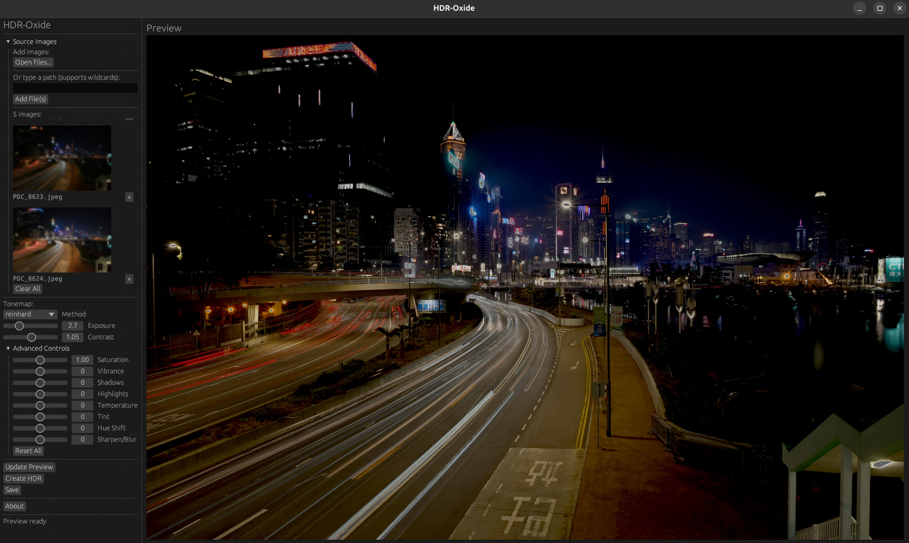

# HDR-Oxide

A Rust application for creating HDR images from exposure-bracketed photographs. Features both GUI and CLI interfaces.



## Key Features

- **Interactive GUI** with real-time preview and responsive UI
- **Comparison Mode** - draggable slider to compare original vs HDR
- **Working Resolution** - fast editing at 2048px, full resolution on export
- **Progress Indicators** for loading, merging, tonemapping, and saving
- **Automatic Exposure Detection** from EXIF metadata
- **Multiple Tone Mapping Methods**: Reinhard, Filmic, Gamma
- **Full Image Adjustments**: exposure, contrast, saturation, vibrance, shadows, highlights, temperature, tint, hue shift, sharpening
- **Image Alignment** (optional): ORB feature matching for handheld shots
- **Parallel Processing**: Rayon-based multi-threaded operations
- **EXR Support**: Read and write OpenEXR HDR files

## Installation

```bash
cargo build --release
```

For alignment support (handheld shots):

```bash
sudo apt-get install libclang-dev libstdc++-13-dev libopencv-dev
CPATH=/usr/include/c++/13:/usr/include/x86_64-linux-gnu/c++/13 cargo build --features alignment --release
```

## Usage

### GUI Mode

```bash
hdr-oxide gui
```

1. Click **Open Files** to add images (JPEG, PNG, TIFF, EXR)
2. Click **Generate HDR** to merge exposures
3. Adjust settings, click **Apply** to preview
4. Use **Compare** to slide between original and HDR
5. Click **Save HDR** to export full resolution (PNG, JPEG, or EXR)

### CLI Mode

```bash
# Basic usage (auto-detect exposures)
hdr-oxide create -i *.jpg -o output.exr

# Save as tonemapped PNG
hdr-oxide create -i *.jpg -o output.png

# With tonemapping options
hdr-oxide create -i *.jpg -o output.exr \
  --tonemap-method filmic \
  --exposure-adjust 1.2 \
  --contrast 1.1

# Manual exposure times
hdr-oxide create -i img1.jpg img2.jpg -e 1/1000 1/125 -o hdr.exr

# EV offsets
hdr-oxide create -i *.jpg --ev-offsets 0,3,7 -o hdr.exr
```

## CLI Options

| Option | Description |
|--------|-------------|
| `-i, --input` | Input images (JPEG, PNG, TIFF, EXR) |
| `-o, --output` | Output file (32-bit float TIFF, EXR, PNG, JPEG) |
| `--no-align` | Skip alignment (tripod shots) |
| `-e, --exposure` | Manual exposure times |
| `--ev-offsets` | EV offsets in stops |
| `--tonemap-method` | reinhard, filmic, gamma |
| `--exposure-adjust` | Exposure (default: 1.0) |
| `--contrast` | Contrast (default: 1.0) |
| `--saturation` | Saturation (default: 1.0) |
| `--vibrance` | Vibrance (-100 to 100) |
| `--shadows` | Shadow lift (-100 to 100) |
| `--highlights` | Highlight compression (-100 to 100) |
| `--temperature` | Color temperature (-100 to 100) |
| `--tint` | Color tint (-100 to 100) |
| `--hue-shift` | Hue rotation (-180 to 180) |
| `--sharpen` | Sharpen/blur (-100 to 100) |

## License

MIT

Copyright (c) 2026 ultrametrics
